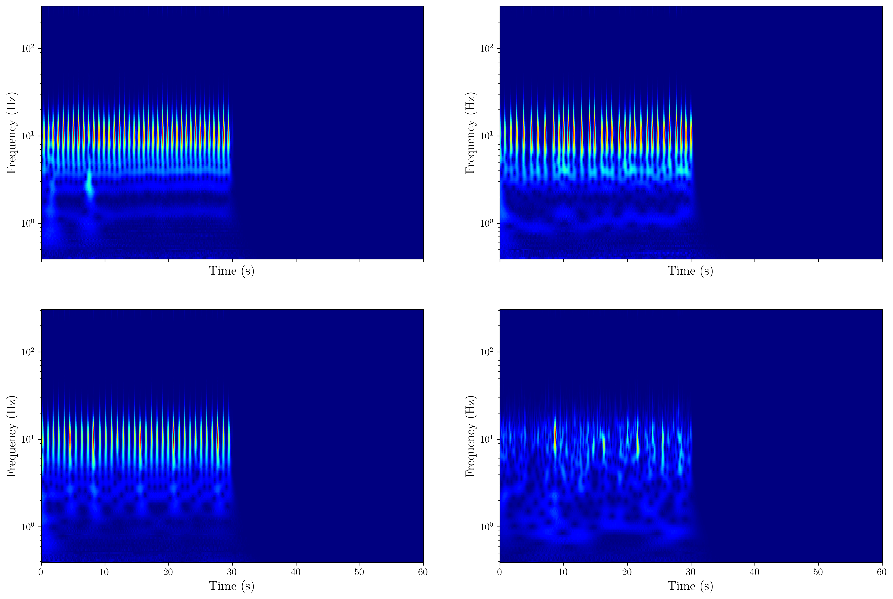

# Atrial Fibrilation classification using Convolutional Neural Networks

## What is Atrial Fibrilation?
Atrial fibrilation (AFib) is one of the most common cardiac arrhythmias, affecting more than $200,000$ people in the United States each year. AFib is characterized by rapid, irregular heartbeats, where the atria of the heart beat out of coordination with the ventricles. Even though AFib is not dangerous by itself, the uncoordinated rhythm increases the risk of blood clotting and stroke.

AFib is detected through an electrocardiogram (ECG) that measures the electrical activities due to depolarization and repolarization of the heart's atria and ventricles. A typical cardiac cycle is shown below


where the signal is composed the P, T and U waves and the QRS complex. Along with an uneven separation of the QRS complexes, AFib is characterized by an absence of P-waves in certain instances of the cardiac cycle (depending on the severity). 

## Deep learning AFib classification

AFib, along with other arrhythmias, classification done manually is a very expensive and labor-intensive process. One way in which this process can be streamlined is to leverage machine learning techniques. Deep learning techniques have recently become heavily employed in such classification tasks since it reduces the task of feature extraction. ECG signals being time-series data, are naturally suited to being analysed using Recurrent Neural Networks (RNNs) such as LSTMs and GRUs.

On the otherhand, however, time-series data can also be trained on $2d$ convolutional neural networks (CNNs) by first converting the time series data into $2d$ representations (spectrograms or scalograms) and feeding the resulting images into the CNNs. Here, we use the AlexNet CNN architecture to analyze a set of ECG data for a purposes of cardiac rhythm classification.

### Dataset

The dataset used in this project was released as part of the [AF Classification from a Short Single Lead ECG Recording: The PhysioNet/Computing in Cardiology Challenge 2017](https://physionet.org/content/challenge-2017/1.0.0/). The training set consists of $8528$ ECG recordings with other important information in MATLAB header files. Each entry is associated with a ``` record_name ``` 'A#####', sampling rate ```f_s``` (all set to $300\:\rm{Hz}$) and signal length ```sig_len``` as important attributes. The dataset also containts ```REFERENCE.csv``` as an annotation file containing the rhythm classification corresponding to each entry. The annotations are as follows -
1. 'N' : normal rhythm
2. 'A' : afib rhtyhm
3. 'O' : other/unclassified rhythm
4. '~' : noise

One big drawback that this dataset poses is the large imbalance in the different classes. This, as we will see, poses significant challenges in obtain high scores in evaluation metrics.

| **class** | **no. of records** |
|-----------|--------------------|
| 'A'       | 738                |
| 'N'       | 5050               |
| 'O'       | 2456               |
| '~'       | 284                |

We plot instances of each class below


### Preprocessing

A list of preprocessing steps precede the CNN training of the dataset. These functions are stored in the ```data_preprocessing.py``` module. The ECG signals contained in the dataset are not of uniform lengths, ranging from a maximum of $18256$ to $2714$ samples, which, when converted to seconds, round to just over $60\:\rm{s}$ and $9\:\rm{s}$. The signal length breakdown is shown below


The first preprocessing step involves fixing the length of all signals to a uniform $18000$-sized array. Signals smaller than these are padded with extra zeros while those that are larger are chopped. Then, purely out of convenience, the uniform length signal arrays are stored in an ```HDF5``` file along with keys containing ```record_name```.

Now, the most important preprocessing step is converting these $1d$ time-series data to $2d$ representations that can be processed by CNNs. This is done using *continuous wavelet transforms* (CWT). A CWT takes in a time-dependent function $f(t)$ and performs the following integral transform
```math
\left[ W_\psi f \right](a,b)=\frac{1}{\sqrt{a}}\int_{-\infty}^\infty dt\:f(t)\overline{\psi}\left( \frac{t-b}{a} \right)
```
where $\psi$ is an *integration kernel* that is slid over the signal by displacements $b$ and scales $a$. Before applying a CWT, the signals are first cleaned to remove artifacts and noise. This is done using the ```neurokit2``` library which has a lot of functionality related to processing physiological time-series data processing. This library has a built-in function called ```ecg_process()``` which can perform suitable filtering and QRS segmentation. Below is an image of a regular cardiac cycle with the QRS complexes isolated and stacked - 


The CWTs are then performed on the cleaned signals. The ```pywt``` library contains the ```cwt``` function perform can perform the transformations. For the kernel $\psi(t)$, we use the complex Morlet wavelet
```math
\psi(t)=\frac{1}{\sqrt{\pi B}}e^{-t^2/B}e^{2\pi i C t}
```
where $B$ is the bandwidth and $C$ is the center frequency. The ```signal_CWT()``` function in the ```data_preprocessing.py``` module performs the transformations on all the signals, saving them as $(224\times224)$ squared-pixel images. The CWTs of the previously shown ECG signal examples are shown below



It can be seen that each class of rhythm has distinguishable features across different frequencies. The weights associated with these frequencies can then be used by a CNN to learn patterns in order to perform classifications. It should be noted that the scalograms are highly dependent on the kind of filter used to clean the ECG signals and the wavelet used in the CWT. We are in the process of identifying the ones which yield higher performancec in evaluation metrics.

### Training AlexNet

AlexNet is a CNN architecture that was designed by Alex Krizhevsky, Ilya Sutskever and Geoffrey Hinton as part of the $2012$ ImageNet challenge. The AlexNet architecture is shown below, where there is a sequence of five convolutional layers followed by three fully-connected linear layers. The input image is of the form $(3\times227\times227)$. Each convolutional layer has a BatchNorm layer. Moreover, the linear layers have Dropout layers with $p=0.5$. The BatchNorm and Dropout layers are there two minimize overfitting during training.
 


All in all, the AlexNet architecture has approximately $60$ million learnable parameters. Hence, training on very large datasets becomes impractical without GPU acceleration. However, the ECG dataset in question is not very large. Nevertheless, training for $150$ epochs on this current CPU (without GPU and other parallelization) takes approximately $6$ hours. A PyTorch class for the AlexNet architecture is shown below where the initial image of shape $\mathcal{B}\times3\times227\times 227$ (where $\mathcal{B}$ is the batch size) is processed through the layers until an output of shape $\mathcal{B}\times 4$ is produced, where $4$ being the number of classes present. The AlexNet class implementation can be found in ```models.py```.

The CNN was trained on three different batch sizes $\mathcal{B}=16,32$ and $64$. A custom PyTorch dataset class ```ScalogramDataset()``` can be found in the ```utils.py``` module on which image transformations are performed before dataloaders are created. Since the training dataset has not train/validation split, we create one by randomly selecting train and test indices from ```REFERENCE.csv```, passing the indices to the dataset class.

During data augmentation, a major transformation is *normalization* where each pixel in each channel is transformed via
```math
\widetilde{\rm{pixel}}_{\rm{R,G,B}} = \frac{\rm{pixel}_{\rm{R,G,B}} - \mu_{\rm{R,G,B}}}{\sigma_{\rm{R,G,B}}}
```
where $\mu_{\rm{R,G,B}}$ and $\sigma_{\rm{R,G,B}}$ are the means and standard deviations of the pixels in the R, G, B channels. This can be calculated through the ```pixel_stats()``` function in ```utils.py```. This yields
```math
\mu_{\rm{R,G,B}}=\left[ 7.23, 26.71, 162.45 \right]
```
and, 
```math
\sigma_{\rm{R,G,B}}=\left[ 35.71, 66.20, 54.35 \right]
```
The large value of $\mu_{\rm{B}}$ is unsurprising due to the color map chosen to represent the scalograms.

The model is trained over $150$ epochs where the training and validation histories (losses and accuracies) are recorded. Optimization was performed using the Adam optimizer while cross-entropy was used for calculating the loss function. Furthermore, a learning rate scheduler, $\eta_{\rm{max}}=10^{-3}$, was used to optimize the learning rate and a weight decay of $10^{-4}$ for regularization.

## Results

Over $150$ epochs of training and validation using AlexNet, the following loss and accuracy curves were obtained for the three batch sizes used -


The best performance came from $\mathcal{B}=64$ with a validation accuracy of just over $76\%$. We observe a lot of variation in the validation loss and accuracy plots epoch-to-epoch possibly as a consequence of the class imbalance inherent in the dataset. For a better measure of performance, we turn our attention to the confusion matrix


Using the confusion matrix, the $F_1$ scores can be calculated as follows
```math
F_{1,i}=\frac{2}{\text{Precision}^{-1}_i + \text{Recall}^{-1}_i },\;\;\;\; i=\{ \text{`AFib', `Normal', `Other', `Noise'}  \}
```
and
```math
F_{\text{overall}}=\frac{1}{4}\sum_{i\in\text{class}}F_{1,i}
```
For $\mathcal{B}=65$, we find an overall $F_1$ score of approximately $0.69$. From the confusion matrix, we see that that CNN performs very well on classifying normal rhythm, it underperforms on the other classes. 

## Continuation

The repository is far from complete and more results will be incorporated over time with the aim of improving the accuracy and $F_1$ scores. Apart from the class imbalance, underperformance can arise from subpar filtering of the raw signals. The raw ECG signals were cleaned using the default filter in ```neurokit2``` and different algorithms have different efficacies at segmenting QRS complexes. Further, other neural networks, such as those with residual blocks, have not been studied.
